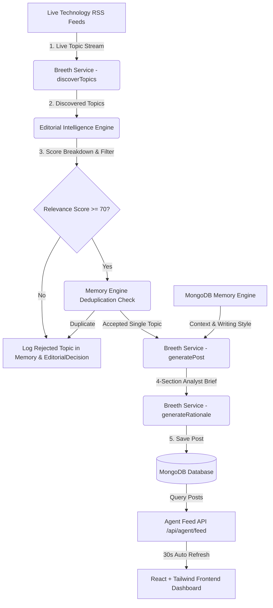

# 🏛️ SignalForge AI — Technical Architecture & Service Boundaries

This document details the system design, data flow, and architectural boundaries of **SignalForge AI**.

---

## 🏗️ System Architecture Diagram



---

## 📂 Directory Structure

```text
backend/
├── config/             # Centralized environment variable loader (env.js)
├── controllers/        # Express HTTP Route Controllers (agent.controller.js)
├── database/           # MongoDB Connection & Auto-Reconnect Strategy (db.js)
├── middleware/         # CORS, JSON, Error Handler Middlewares
├── models/             # Mongoose Schemas (Post, Topic, PersonaConfig, Memory, EditorialDecision)
├── routes/             # Express API Endpoint Routes
├── scheduler/          # node-cron Autonomous Agent Scheduler (cron.js)
├── services/           # Business Logic Layer (breeth.service.js, agent.service.js, memory.service.js)
├── utils/              # Structured Winston Logging Utility (logger.js)
├── app.js              # Express Application Setup
└── server.js           # Server Entry Point & Restart Recovery

client/
├── public/             # Static Assets
└── src/
    ├── api/            # Axios API Client (client.ts)
    ├── components/     # Reusable UI Components (Navbar, Cards, Badges)
    ├── pages/          # 6 Pages (Home, Dashboard, LiveFeed, Persona, Settings, About)
    ├── App.tsx         # Main Application Layout & React Router
    ├── main.tsx        # React DOM Root
    └── index.css       # TailwindCSS Imports & Glassmorphic Utilities
```
